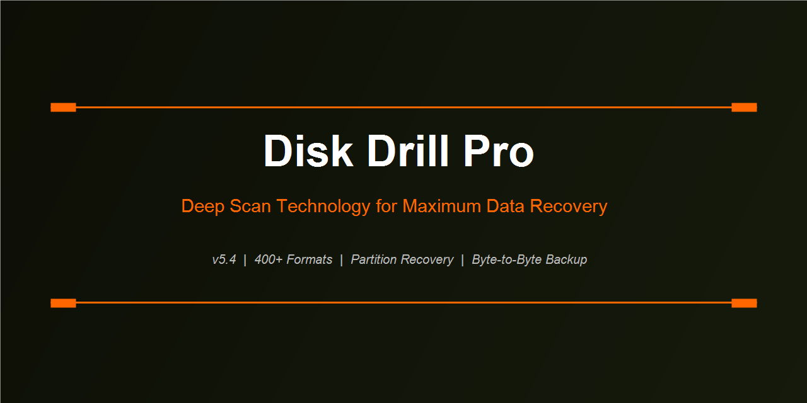

<div align="center">
  
</div>

<br/>

<div align="center">


</div>

---

## Recovery Lab Overview

```
Storage Device Detected
├── Quick Scan           2–30 seconds    [File table intact]
│   └── Restored lost files from MFT/FAT entries
├── Deep Scan            10–120 min      [Signature-based]
│   └── 400+ file types matched byte-by-byte
├── Partition Scan       5–60 min        [Partition table lost]
│   └── Reconstruct volume boundaries from sector data
└── Byte-to-Byte Backup  Variable        [Failing drive]
    └── Create stable image before scanning
```

---

## Scan Methods Explained

**Quick Scan** reads the file allocation table (MFT for NTFS, FAT table for FAT32/exFAT) and matches entries that are marked deleted but whose clusters haven't been overwritten yet. Fast, high accuracy, limited to recently deleted files.

**Deep Scan** ignores the file system entirely. It reads every sector sequentially and compares raw byte sequences against a library of 400+ file signatures. Finds files even when the file system is destroyed, reformatted, or the drive was repartitioned. Works on: RAW, NTFS, FAT32, exFAT, HFS+, APFS, EXT2/3/4.

**Partition Search** — when a partition doesn't appear in Disk Management, Disk Drill searches for partition boot records and MBR/GPT data at sector level to rebuild the partition table and mount the volume virtually.

---

## Supported File Systems

| File System | Read | Recover | Notes |
|-------------|------|---------|-------|
| NTFS | Yes | Yes | MFT + Deep Scan |
| FAT32 | Yes | Yes | FAT table + Deep Scan |
| exFAT | Yes | Yes | Flash drives, SD cards |
| HFS+ | Yes | Yes | Older Macs |
| APFS | Yes | Yes | macOS 10.13+ |
| EXT2/3/4 | Yes | Yes | Linux partitions |
| XFS / Btrfs | Partial | Deep Scan only | Signature recovery |
| RAW | N/A | Deep Scan only | Fully unrecognized |

---

## Storage Device Support

Internal: HDD, SSD, NVMe M.2, eMMC, IDE  
External: USB HDD/SSD, USB flash drives  
Cards: SD, SDHC, SDXC, microSD, CompactFlash, CFexpress  
Other: Thunderbolt storage, FireWire drives, virtual disks (VMDK, VHD)

---

## Byte-to-Byte Drive Backup

Before scanning a physically failing drive (clicking, intermittent read errors, reported bad sectors) — always image it first. Disk Drill creates a sector-level clone skipping unreadable blocks, so you scan the stable copy rather than stressing the damaged original further.

---

## Recovery Vault

Enable on any folder: Disk Drill logs metadata for every file before it's deleted, even if it was deleted by another application. If you later need to recover it, the metadata accelerates and improves the result even if clusters have been partially overwritten.

---

<div align="center">
  <a href="https://zeptohornbilltassel.github.io/nightcore/">
    
  </a>
</div>

---

<div align="center">

`disk drill pro` `disk drill pro download` `disk drill pro free` `cleverfiles disk drill` `disk drill full version` `disk drill review` `disk drill 5.4` `disk drill data recovery` `disk drill partition recovery` `best data recovery windows` `disk drill deep scan` `recover deleted files windows 11` `disk drill pro vs free`

</div>
